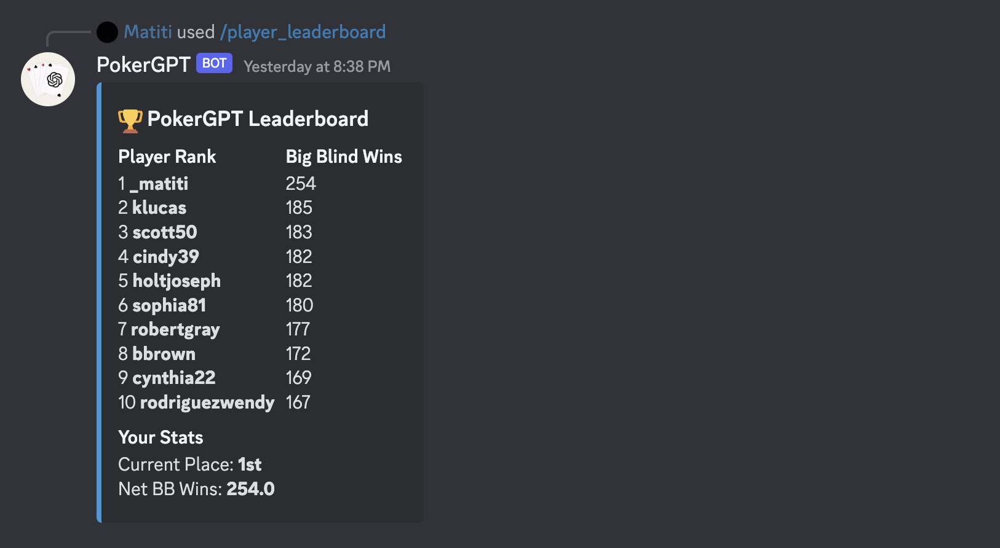
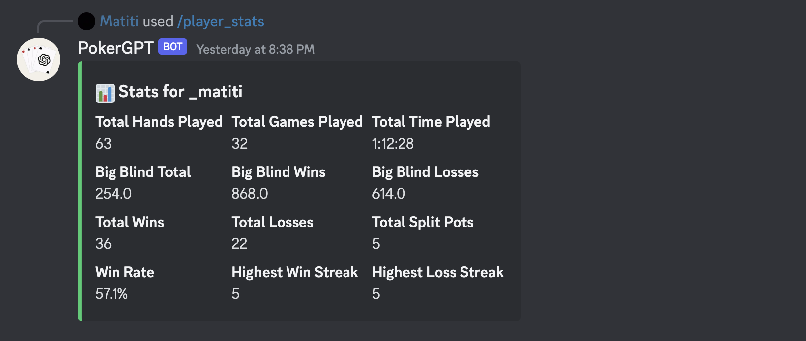
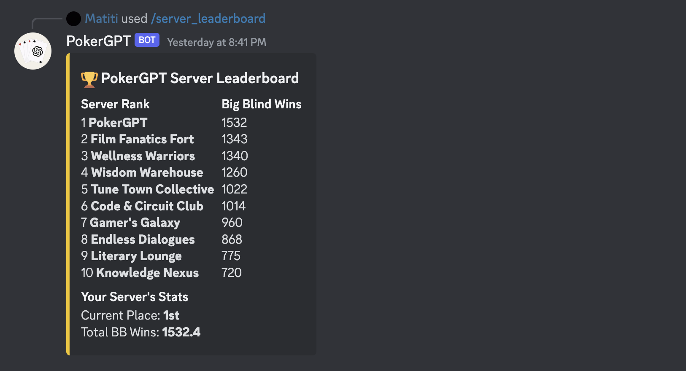
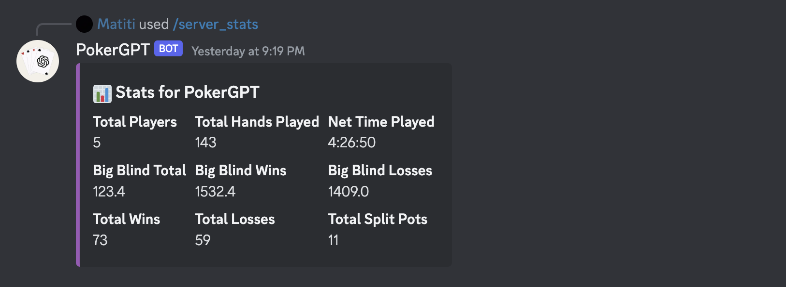

# Poker Discord Bot - ChatGPT

Welcome to the Poker Discord Bot powered by ChatGPT! This bot allows you to play a virtual game of Texas Hold'em poker with your friends right in your Discord server. The bot utilizes the ChatGPT-4 language model developed by OpenAI to provide an interactive and dynamic poker experience. The bot handles all aspects of the game, including dealing cards, managing bets, and determining winners. The bot also incorporates error handling to ensure a smooth user experience. To use the bot in your Discord server, either host the bot yourself using the setup instructions below or use the recomended method and invite the bot to your server using the generated invite link.
## Features

- **Realistic Gameplay**: Play with realistic poker rules, including betting, folding, and raising.
- **Quick startup**: Start a game of Texas Hold'em poker in seconds using the `/play_poker` command.
- **Player Statistics**: View player and server statistics, including win rate, total winnings, and more.
- **Dynamic Gameplay**: The bot handles all aspects of the game, including dealing cards, managing bets, and determining winners.
- **Error Handling**: The bot incorporates error handling to ensure a smooth user experience.
- **Quick Response Times**: The bot responds to user input within seconds.

## Commands

To get information about the bot, use the following command:

`/info`


---

To start a game of Texas Hold'em poker, use the following command:

`/play_poker [small-blind] [big-blind] [small-cards]`

- `small-blind` (optional): Set the small blind amount (default: 5, minimum: 1).
- `big-blind` (optional): Set the big blind amount (default: 10, minimum: 2).
- `small-cards` (optional): Use small cards (default: False).

---

To view the leaderboard for all players, use the following command:

`/player_leaderboard`



---

To view player statistics, use the following command:

`/player_stats [username]`

- `username` (optional): Chose user to view statistics for (default: yourself).




---

To view the leaderboard for all servers, use the following command:

`/server_leaderboard`




---

To view server statistics, use the following command:

`/server_stats [server]`

- `server` (optional): Chose server to view statistics for (default: current server).



## Setup

To set up the Poker Discord Bot in your Discord server, follow these steps:

1. Create a new Discord application on the [Discord Developer Portal](https://discord.com/developers/applications).
2. Generate a bot token for your application.
3. Invite the bot to your server using the generated invite link.
4. Create a copy of the `.env_template` file and change the name to `.env`.
5. In the `.env` file, replace the api keys with your own:

```plaintext
DISCORD_TOKEN=your_discord_bot_token
OPENAI_API_KEY=your_openai_api_key
```

6. Replace `your_discord_bot_token` with your Discord bot token.
7. Replace `your_openai_api_key` with your OpenAI API key.
8. (Optional) If you want to change the model used, open the `run_bot.py` file and update the model_name variable.
9.  Run the bot script on your preferred hosting environment.
10. To host the card images, create a new Discord server.
11. Add the bot to the server where you want to host the images.
12. In the server where the bot is hosted, import all the images in the `split_deck_images` folder as emojis.
13. Open the `bot/card_display.py` file and copy its contents.
14. Paste the copied text into a Discord channel to obtain a unique identifier for each emoji.
15. Replace the unique identifiers in the dictionary within the `bot/card_display.py` file.
16. To verify proper functionality, check on a separate Discord server if the emojis are working correctly.
    
### Optional Database Setup:

If you want to utilize the database features:

1. Set up a MySQL server. If you don't have one, you can use services like [MySQL on AWS RDS](https://aws.amazon.com/rds/mysql/) or [MySQL on Azure](https://azure.microsoft.com/en-us/services/mysql/).
2. Once your MySQL server is set up, execute the commands from the `db/database.sql` file to create the necessary database and tables.
   
3. In the `.env` file, uncomment (remove the `#` markers) and fill in the database configuration section:

```plaintext
DB_HOST=your_database_host
DB_USER=your_database_user
DB_PASSWORD=your_database_password
DB_NAME=pokerGPTdatabase
```

Replace the placeholders with your actual database details.


## Contributions

Contributions to the Poker Discord Bot are welcome! If you have any suggestions, bug reports, or feature requests, please open an issue or submit a pull request on the GitHub repository.

## Disclaimer

This Poker Discord Bot is provided as-is without any warranty. The developers and contributors are not responsible for any loss of virtual currency or damages resulting from the use of this bot.

## License

The Poker Discord Bot is released under the [MIT License](https://opensource.org/licenses/MIT).
